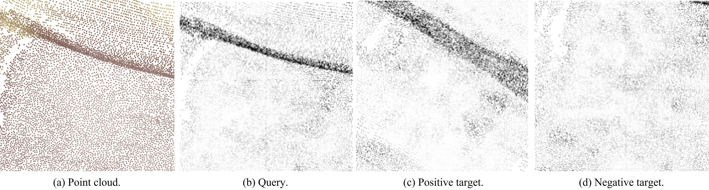
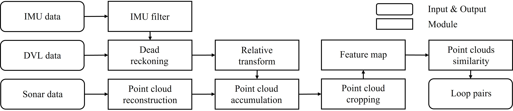

# Point Cloud Structural Similarity-based Underwater Sonar Loop Detection
[[Video 📺]](https://youtu.be/DiC95bhBz6Q?si=6keI8v7SZbz1RMCQ), [[Paper 📖]](https://arxiv.org/pdf/2409.14020)

[Donghwi Jung](https://donghwijung.github.io/), [Andres Pulido](https://andrespulido8.github.io/), [Jane Shin](https://janeshin-website.github.io/people/jane/), [Seong-Woo Kim](https://arisnu.squarespace.com/director)

This is an implentation of *"Point cloud structural similarity-based underwater sonar loop detection"* which indicates **detecting loops based on the structural similarity of point clouds generated from the data acquired by MBES**.

<p align="center">
  
</p>

## System Overview
<p align="center">
  
</p>


## Dependencies
- The script [generate_data_from_antarctica.py](https://github.com/donghwijung/point_cloud_structural_similarity_based_underwater_sonar_loop_detection/blob/main/generate_data_from_antarctica.py) relies on the [AUVLib](https://github.com/nilsbore/auvlib) library.
  - To run this script, follow the setup instructions provided in the AUVLib repository.
  - All other scripts in this project are independent of AUVLib.

## Installation
```bash
conda env create -f environment.yaml
conda activate PCSS
```

## Dataset
### Download
- [Download](https://drive.google.com/drive/folders/1MV_GaNRxmcbjUQT7r6kNH1NtUX6jMK07?usp=sharing) datasets
- Unzip the downloaded dataset
### Data processing
If you would like to generate the data yourself, follow the process outlined below.
To process the Antarctica dataset, the *auv_lib* library must be installed. The *antarctica_2019.cereal* file is also required. You can [download](https://drive.google.com/drive/folders/1UWxJw6cNCvzowqWpzo5eSEUT_0734tsG) the file.
```bash
python generate_data_from_antarctica.py
```
or
```bash
python generate_data_from_seaward.py
# ex) python  generate_data_from_seaward.py --data_id 3
```

## Execution
```bash
python execute.py
# ex) python execute.py --data_path data --data_id 1 --neighborhood_size 100 --score_threshold 2.95
```

## Acknowledgements
The codes and datasets in this repository are based on [PointSSIM](https://github.com/mmspg/pointssim), [Antarctica](https://github.com/tjr16/bathy_nn_learning), and [Seaward](https://seaward.science/data/pos/). Thanks to the authors of these codes and datasets.

## Citation
```
@article{jung2025point,
  title={Point Cloud Structural Similarity-Based Underwater Sonar Loop Detection},
  author={Jung, Donghwi and Pulido, Andres and Shin, Jane and Kim, Seong-Woo},
  journal={IEEE Robotics and Automation Letters},
  year={2025},
  publisher={IEEE}
}
```
